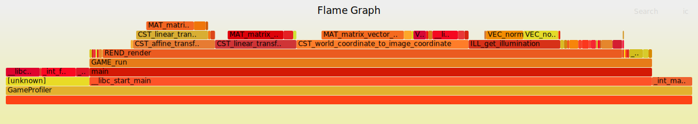
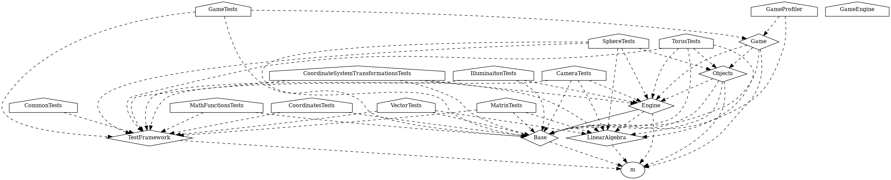

# Game Engine


A simple game engine. It contains a graphics rendering pipeline that renders a model consisting of
3D objects, a camera and a light source to a 2D screen. The objects are illuminated based on the
their relative position to the light source. It is possible to define an arbitrary camera position
and rotation in the world. As this is just a simple game engine the screen output "pixels" are
ASCII characters printed to the terminal.

The engine lacks some important modules that are usually part of a game engine like physics, audio
and collision handling. The purpose of this project is not to build a complete game engine.

Another important aspect of this project is that it contains a complete C development environment,
including:

* Compiler (gcc)
* Build system (cmake, make and ninja)
* Documentation generator (doxygen)
* Test framework ("home made" and ctest)
* Test coverage (gcov and lvoc)
* Static code analyzers (cppcheck, clang-tidy and include-what-you-use)
* Dynamic code analyzers (address sanitizer, undefined behavior sanitizer, valgrind)
* Build profiler (ninja tracing)
* Performance profiler (perf and flamegraphs)

This project could serve as an inspiration how to set up other C projects.

## Usage

To build and run the application run the following commands.

```
cmake -S <path to GameEngine> -B build -DCMAKE_BUILD_TYPE=Release
cd build
make
./GameEngine
```

### Documentation

To build the documentation run the following commands.

```
cmake -S <path to GameEngine> -B build
cd build
make doc
```

The generated documentation can be found in `html/index.html`.

### Test

To build and run the tests run the following commands.

```
cmake -S <path to GameEngine> -B build -DCMAKE_BUILD_TYPE=Debug
cd build
make
ctest --verbose
```

Note that `ctest` have other flags that can e.g. select which tests to run. Also note that is is
built using the `Debug` configuration. This includes address sanitizer (asan) and undefined behavior
sanitizer (ubsan). These are runtime instrumentations that will detect memory errors and undefined
behavior. Asserts are also enabled in this configuration. The `Debug` configuration also includes
debug information which makes it easier to find where a particular problem occurred as it will
contain a detailed call stack.

#### Test Coverage


Test coverage is a useful tool that measures how much of the source code is covered by tests. To
build and run test coverage, run the following command.

```
cmake -S <path to GameEngine> -B build -DCMAKE_BUILD_TYPE=Debug
cd build
make
ctest --verbose -E GameTests
make lcov
```

Note that the `GameTests` is excluded as it is a smoke test and does not perform a proper
functionality test which means that it may be unfair to include it in the coverage report. The test
coverage report can be found in `lcov/index.html`.

#### Test under valgrind

To build and run the tests under valgrind run the following commands.

```
cmake -S <path to GameEngine> -B build -DCMAKE_BUILD_TYPE=RelWithDebInfo
cd build
make
ctest -T memcheck --verbose
```

Note that the `RelWithDebInfo` configurations is used here. This configuration includes debug
information which makes it easier to find where a particular problem occurred as it will contain a
detailed call stack. Unfortunately valgrind is not compatible with the sanitizers used in the
`Debug` configuration. To get full coverage of the dynamic code analyzers it is therefore required
to run the test under two configurations (`Debug` and `RelWithDebInfo` with valgrind).

### Build Profile


The [ninja tracing](https://github.com/nico/ninjatracing) tool can be used to profile the build
performance. With this tool it is easy to see which parts of a project that takes the most time to
build and would be a good subject to optimizations, like refactoring or reducing the number of
includes.

The ninja build system is required for this tool to work. It is easy to switch from make to ninja
in cmake, just add `-G Ninja` to the cmake command.

```
cmake -G Ninja -S <path to GameEngine> -B build -DCMAKE_BUILD_TYPE=Release
cd build
ninja
NINJATRACING=<path to ninjatracing>
python3 $NINJATRACING/ninjatracing.py .ninja_log > cmake_build_trace.json
```

Note that this can be done for any configuration. To view the file open Chrome and enter
`about:tracing`, then drag and drop the `cmake_build_trace.json` file.

Switching to ninja for all kinds of builds might actually be a good idea since the ninja build
system is faster than make.

### Performance Profile

A very useful tool for performance profiling is
[perf](https://perf.wiki.kernel.org/index.php/Main_Page). It can profile a lot of "events" like
clock cycles, branch misses, cache misses, etc. A useful first step might however be to use the
`top` command while running the application to see how much resources it uses.

The application must be built with the following flags:

* `-g` (debug symbols)
* `--fno-omit-frame-pointers` (call stacks)

If using a separate profiling application consider using the same optimizations as the target
application, e.g. link time optimizations (`-flto` and `-ffat-lto-objects`).

Some useful flags are the following.

`perf record`

| Flag | Description                                                                                                   |
| ---- | ------------------------------------------------------------------------------------------------------------- |
| -e   | Records program counter when this event occur. Use cpu-clock:pp for timing (number of p:s controls precision) |
| -c   | Sample every n:th occurrence of the event                                                                     |
| -g   | Record call graph                                                                                             |
| -F   | Sampling frequency, chose wisely to avoid accidentally sampling in lockstep with some periodic activity       |
| -o   | Output file                                                                                                   |


`perf report`

| Flag              | Description                                                        |
| ----------------- | ------------------------------------------------------------------ |
| -g graph          | Show percentage relative to total                                  |
| -g fractal        | Show percentage relative to parent                                 |
| \-\-percent-limit | Do not include functions with lower percentage                     |
| \-\-children      | Accumulate children cost to parent, also sort output by this value |
| \-\-no-children   | Only show self cost, sort by this value                            |
| -n                | Show sample count                                                  |
| -p                | Match parent symbol                                                |
| -x                | Only show symbols with parent match                                |

The following commands are some example of useful things that perf can perform.

List the available events:
```
perf list
```

Get an overview of the application performance:
```
perf stat -e task-clock,cycles,instructions,cache-references,cache-misses,branches,branch-misses -d -- src/Game/profile/GameProfiler
```

Perform a detailed profiling of the execution time:
```
perf record -e cpu-clock:pp -g -F 997 -o perf.data -- src/Game/profile/GameProfiler
```

Create a top down view of the execution time:
```
perf report -g fractal --children --inline -n --percent-limit 0 -x -p GAME_run -i perf.data
```

Press `a` on a symbol to annotate, then press `o` to fix the "broken" assembler. Press `s` to show the source code.

Create a bottom up view of the execution time:
```
perf report -g fractal --no-children --inline -n --percent-limit 0 -x -p GAME_run -i perf.data
```

Generate top down and bottom up text reports:

```
perf report -g fractal --no-children -n --percent-limit 5 -x -p GAME_run --percentage relative --stdio -i perf.data > bottom_up_report.txt
perf report -g fractal --children -n --percent-limit 5 -x -p GAME_run --percentage relative --stdio -i perf.data > top_down_report.txt
```

Annotate (i.e. show the execution time for each assembler/source code line) a specific function use:
```
perf annotate -i perf.data -s MAT_matrix_vector_multiplication
```

#### Flame Graphs



[Flame graphs](https://www.brendangregg.com/flamegraphs.html) is a neat
visualization of perf output. Download the flame graphs tool
[here](https://www.brendangregg.com/flamegraphs.html). Then run the following
commands to generate a flame graph.

```
perf script -i perf.data > out.perf
FLAMEGRAPHS=<path to flamegraphs>
$FLAMEGRAPHS/stackcollapse-perf.pl out.perf > out.folded && $FLAMEGRAPHS/flamegraph.pl out.folded > flamegraph.svg
```

The `flamegraph.svg` can then be viewed in e.g. Chrome.

Another useful perf visualizer is [Hotspot](https://github.com/KDAB/hotspot).

### Requirements

The following are required

* gcc
* cmake
* ninja
* doxygen
* graphviz
* cppcheck
* clang-tidy
* valgrind
* lcov
* include-what-you-use

On an Ubuntu system these can be installed with the following commands.

```
sudo apt-get update && sudo apt-get upgrade -y
sudo apt autoremove -y
sudo apt-get install gcc -y
sudo apt-get install cmake -y
sudo apt install ninja-build -y
sudo apt-get install doxygen -y
sudo apt install graphviz -y
sudo apt-get install cppcheck -y
sudo apt-get install clang-tidy -y
sudo apt install valgrind -y
sudo apt install lcov -y
sudo apt install iwyu -y
```

#### perf

Might not be so easy to install as it is tightly coupled to the Linux kernel. In some cases the
only option is to build from source. The source can be found here:
`https://mirrors.edge.kernel.org/pub/linux/kernel/tools/perf/` Start by determine the Linux kernel
version by running the following command.

```
uname -r
```

Then select the corresponding version at the source (follow the previous link), and run the
following commands (replace 5.10.0 with the actual version) to build perf.

```
sudo apt install build-essential flex bison libssl-dev libelf-dev
wget https://mirrors.edge.kernel.org/pub/linux/kernel/tools/perf/v5.10.0/perf-5.10.0.tar.xz
wget https://mirrors.edge.kernel.org/pub/linux/kernel/tools/perf/v5.10.0/sha256sums.asc
sha256sum perf-5.10.0.tar.xz
grep perf-5.10.0.tar.xz sha256sums.asc
tar xf perf-5.10.0.tar.xz
cd perf-5.10.0/
make -C tools/perf install
PATH="$HOME/perf_build/perf-5.10.0/tools/perf:$PATH"
perf version --build-options

```

Consider setting up the `PATH` in a nicer and more persistent way. See the
[installation instructions](https://mirrors.edge.kernel.org/pub/linux/kernel/tools/perf/HOWTO.build.perf)
for more information.

## Architecture

This chapter describes all modules of the game engine.

### Base

Contains utilizes needed by most other modules. This includes math functions and helper macros to
e.g. specify unused function parameters and get the length of an array.

### Engine

This is the core of the game engine. It contains several units.

#### Camera

The camera of the game. Defines the camera intrinsic (focal length, principal point, etc.) and
extrinsic (camera position in relation to the world coordinate system) calibration.

#### Coordinate System Transformations

Provides functionality to convert 3D coordinates from one coordinate frame to another (linear and
affine transformations). It can also convert a 3D world coordinate to a 2D image coordinate.

#### Frame Synchronizer

A faster or slower computer should not make the time go faster or slower in the game. This unit
makes sure the game run in a certain constant frame rate.

#### Illumination

Handles the illumination of objects.

#### Object

The interface of a 3D objects.

#### Renderer

The heart of the engine. This unit takes a model consisting of 3D objects and their positions, a
camera calibration and a light source as input. The input is rendered and output to the screen. To
accomplish this it uses all other units of the Engine module.


### Game

A game implemented using the game engine. Well, it is not really a game, it just a sphere orbiting
a rotating torus ("donut").

### Linear Algebra

Defines matrix, vector, and function that operates on these types. Some example functions are
matrix matrix multiplication, matrix vector multiplication, matrix transpose, vector normalization
and vector dot product.

### Test Framework

A simple "home made" test framework. It lacks a lot of features like setup/teardown, fixtures,
mocks, etc., but using it in conjunction with `ctest` it is sufficient for a small project like
this. There exists a lot of test frameworks for C but not really any "standard" one that most
project uses.

#### Example

The following is an example of a test suite that uses the framework.

```
#include "TestFramework/test_framework.h"

int TF_test_case_status; /* All test suites must define this global variable. */

static void test_my_function_a(void)
{
    TF_assert(my_function_a(1) == 4);
}

static void test_my_function_b(void)
{
    TF_assert(my_function_b(1) == 2);
}

int main(void)
{
    TF_test_case test_cases[] = {
        test_my_function_a,
        test_my_function_b,
    };

    return TF_run_suite(test_cases, 2);
}
```

## Dependency Graph



It is possible to generate dependency graphs using `cmake`. To generate this graph run `cmake` as
usual but append `--graphviz=dependendy_graph.dot` to the command. An image of the graph can then
be generated by running the following command.

```
dot -Tpng -o build/dependency_graph.png dependency_graph.dot
```

## TODO

* Find a good way to temporarily disable printf output to not clutter output for some test.
* Add unit test for the Renderer unit. This can be done by creating simple objects like planes with
  constant surface normals. Then it is possible to test if the projections get the correct size in
  the image and that they occlude eachother correctly. It is also a good idea to test that objects
  behind the camera or outside the frame are handled correctly.
* Use threads to speed up rendering of objects.
* Add tools that can extract heap usage (e.g. valgrind Massif) and stack usage (maybe use gcc
  -fstack-usage in combination with [cflow](https://www.gnu.org/software/cflow/manual/cflow.html)
  and write a Python script that walks the cflow graph and collects stack usage information from
  the compiler output).
